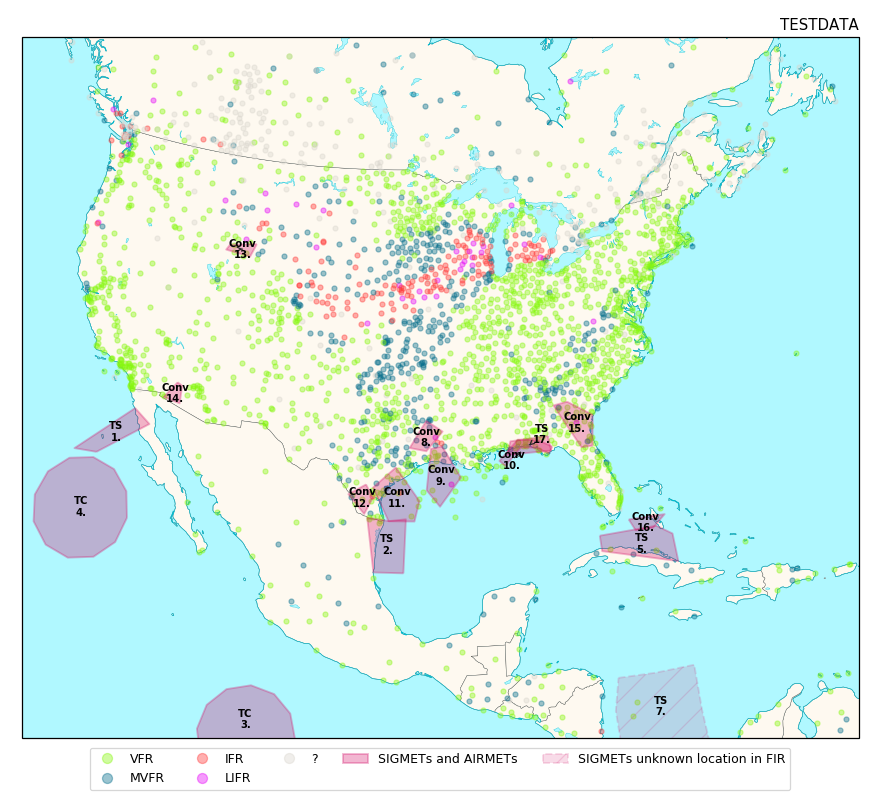

# Plot SIGMETs, AIRMETs and METARs on a Map
This program retrieves the US SIGMETS, US CWAs, international SIGMETS and  METARs from the 
aviationweather.gov GeoJSON web services and plots a map containing  the SIGMETs, AIRMETs and 
METARs fligth category received.  

    

## Features
The map contains many features. A base map of 10m resolution containing countries, lakes, land 
and oceans. On top of this all METARs available for the region are plotted, colour coded for 
their current flight categories. 

SIGMETs are added on top of this. Both polygon based and point based SIGMETs are supported. 
All SIGMETs which could not be correctly parsed by the aviationweather.gov webservice are shown
in a lighter tone with a different border. 

## Architecture
Cartopy is used for plotting the base map and for projecting the map data onto a matplotlib plot. 
This is served up by a tiny Flask webservice. Images are not included in the result of the web service
call but stored in Flasks static folder. 

These images are automatically deleted by a clean up process which runs every two hours. 

## Testing Strategy
Since testing map plotting directly would be quite labor intensive a semi-automated approach was 
chosen. Reference images are generated based upon the downloaded data. The downloaded data is 
intercepted and also serialized to json files. These reference images are used for comparison to the
ones generated in the unit tests. 

Specially crafted input files with expected errors can also be used
for validating the behaviour of the map plotting functionality.  

Whenever functionality which influences the map rendering new reference images need to be generated
these reference images are then checked by hand for the expected rendering result and from there on
used for unit testing. 